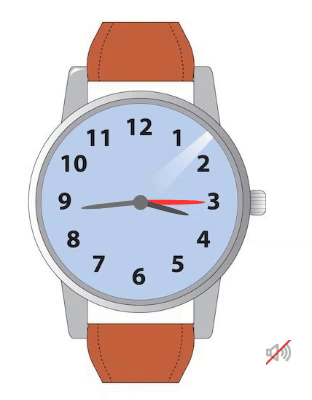

## What is it?
##### This is a wristwatch that shows you the time according to the time zone you are in. By pressing the volume button at the bottom of the screen, you can even hear the ticking sound of the clock.
##### [Click](https://ali-asadpour.github.io/clock/) to have your own watch!

## How it Works?


## How can we access the current time?

```javascript

let nowDate, nowHour, nowMinute, nowSecond

setInterval(() => {
    nowDate = new Date()

    nowHour = nowDate.getHours()
    nowMinute = nowDate.getMinutes() 
    nowSecond = nowDate.getSeconds() 

    console.log(`${nowHour} : ${nowMinute} : ${nowSecond}`)
}, 1000)
```
##### With this code you can access the clock every second!

## Scills:
-  

-  

-  
